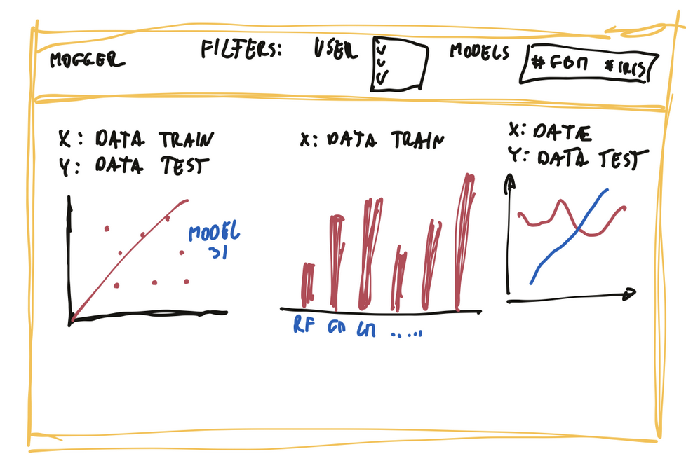

# mogger

Logger for predictive models

## Key features

- light and easy to deploy server and client
- R (optionally python) API for logging predictive models
- interactive interface for browsing models (with filters based on meta data ans hashes)

## Flow

### Usecase 1: model logging

Pre:

1. User creates model M. 

mogger:

2. extracts basic metadata
3. serialize model to a binary version (optional)
4. calculates unique hash for the model

Pre:

5. User evaluates model performance on data D.

mogger:

6. extracts basic metadata for the data
7. serialize data to a binary version (optional)
8. calculates unique hash for the data

9. stores experiments: variouse performance metrics for model M and data D 

### Usecase 2: exploration of logs

Pre:

10. performance metrics are stored in a folder / light database

mogger:

11. interactive interface for filtering experiments based on date, user, metadata, hashes

# First version of the interface

