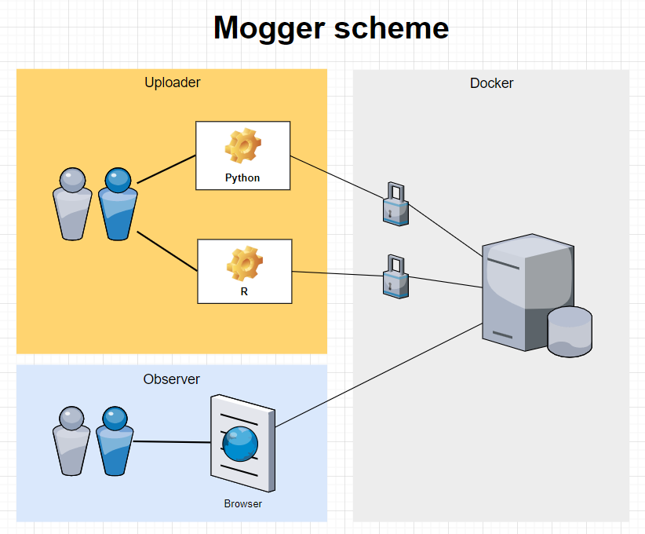
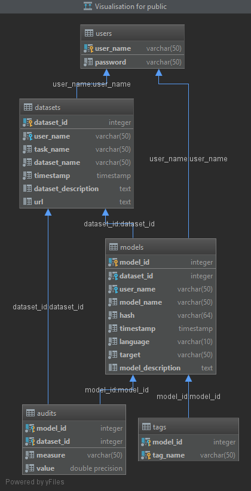
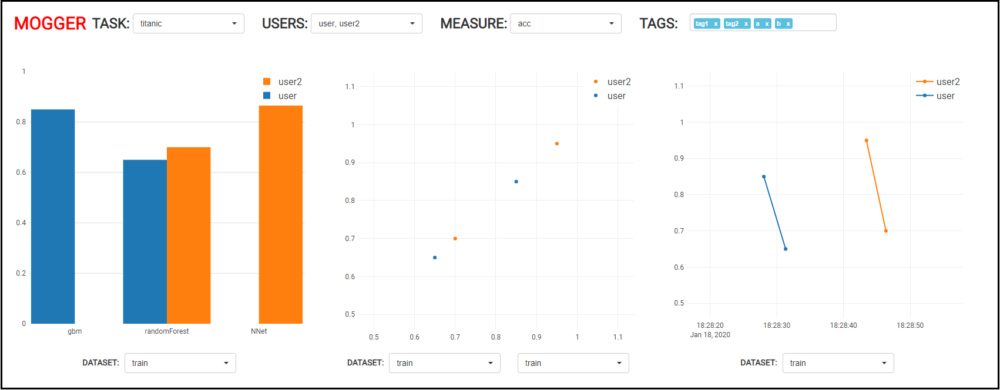

```{r setup, echo=FALSE, cache=FALSE}
library(knitr)
suppressWarnings(library(rmdformats))

## Global options
options(max.print="75")
opts_chunk$set(echo=TRUE,
	             cache=TRUE,
               prompt=FALSE,
               tidy=TRUE,
               comment=NA,
               message=FALSE,
               warning=FALSE,
               eval = FALSE)
opts_knit$set(width=75)
```


# Introduction

The application that allows storing the metadata of models and their audits in the database.
It also provides a web interface with visualizations of the database contents.
Storing and acquiring data is made possible through the REST API. 

--------------------------------------------

# Key Features

1. Light and easy to deploy server and client
2. R and Python API for logging predictive models
3. Interactive interface for browsing models (with filters based on datasets, ids, users, etc.)

--------------------------------------------

# Technologies
1. Java 11, SPRING
2. POSTGRESQL
3. DOCKER
5. Python, R
7. Bootstrap.js, Plotly.js

--------------------------------------------

# Description with Diagrams

## Project scheme

This application allows the users to upload model data and their audits to the database.
It can be done with R and Python packages. The observer can use interactive site with visualizations
to examine model audits.

<center>{width=600px}</center>

## Database structure

The database has a following structure presented below. `USERS` are stored with their `passwords` used to authenticate.
Each user can have multiple models and each model can have multiple audits. The model has a `datasetId`
of which it was trained on. The audit has a `datasetId` of which it was tested on. `DATASETS` are
groupped into tasks with a `taskName`. `MODELS` and `AUDITS` are often joined to retrieve the data needed for the plots.

<center></center>

## Interface

The interface has a following layout presented below. One can select task, users and measure to filter
the models. For each plot one can select datasets to filter the models further. 
The first plot shows models measure value on a given dataset for multiple users.
The second plot shows model measure values on two given datasets for multiple users.
The third plot shows model measure values in time on a given dataset for multiple users.

<center></center>

--------------------------------------------

# Endpoints
Due to bilateral needs of an application it is necessary to cover a considerable amount of endpoints. 
These can be divided into two parts: 

1. Allows prospect users to send their data to the database
2. Fetches proper data from the database to make plots and fill the inputs

Client packages and front-end functionalities also create an idea of endpoints division mentioned above.

--------------------------------------------

## user

### Add new user 

**POST /mogger/api/v1/user**

```{js}
Body:
{
"userName": string,
"password": string
}
```
    
--------------------------------------------

## tag

### Add new tag 

**POST /mogger/api/v1/tag** 

```{js}
Body:
{
"modelId": integer,
"tagName": string
}
```
    
### Retrieve a list of all tags

**GET /mogger/api/v1/tag** 
    
```{js}
Example response:
[{"modelId":1,"tagName":"tag1"}, {"modelId":1,"tagName":"tag2"}, {"modelId":2,"tagName":"tag3"}]
```
   
--------------------------------------------

## dataset

### Add new dataset

**POST /mogger/api/v1/dataset** 
    
```{js}
Header:
{
"userName": string,
"password": string
}

Body:
{
"datasetName": string,
"userName": string,
"taskName": string,
"datasetDescription": string,
"url": string
}
```
    
### Retrieve a list of unique tasks 

**GET /mogger/api/v1/dataset/tasks** 

```{js}
Example response:
["task_classification", "titanic_task"]
```

### Retrieve a list of unique datasets for a given task

**GET /mogger/api/vi/dataset/uniqueDatasets/{taskName}**

```{js}
Example response:
[{"datasetName":"titanic_train","datasetId":1}, {"datasetName":"titanic_test","datasetId":2}]
```

--------------------------------------------

## model

### Add new model 

**POST /mogger/api/v1/model**
    
```{js}
Header:
{
"userName": string,
"password": string
}

Body:
{
"datasetId": integer,
"userName": string,
"modelName": string,
"hash": string,
"language": string,
"target": string,
"modelDescription": string
}
```


### Retrieve a list of unique users for a given task

**POST /mogger/api/v1/model/uniqueUsers/{taskName}**

```{js}
Example response:
["user1", "user2"]
```

--------------------------------------------

## audit

### Add new audit

**POST /mogger/api/v1/audit** 
    
```{js}
Header:
{
"userName": string,
"password": string
}

Body:
{
"modelId": integer,
"datasetId": integer,
"measure": string,
"value": float,
}
```

### Retrieve a list of all measures

**GET /mogger/api/v1/audit/measures**

```{js}
Example response:
["acc", "auc"]
```
    
### Retrieve a list of unique measures for a given task

**GET /mogger/api/v1/audit/uniqueMeasures/{taskName}**


```{js}
Example response:
["acc", "auc"]
```

--------------------------------------------

## plot

### Retrieve necessary data to create the Model Audit plot

**POST /mogger/api/v1/plot/modelAudit**

The most important value is datasetId - it gives an information which dataset' models to process and analyse. 
Another filtering informations are userNames and measure - they allow to retrieve only appropriate data.

Necessary output is returned in HTTP Response body in the form of JSON.
    
```{js}
Body:
{
"datasetId": integer,
"userNames": string[],
"measure": string
}

Example response:
[
  {
    "name": "user",
    "x": [
      "gbm",
      "randomForest"
    ],
    "y": [
      0.85,
      0.65
    ],
    "text": [
      "Model id: 1 </br>Model dataset id: 1 </br>Model language: python </br>Audit dataset id: 1",
      "Model id: 2 </br>Model dataset id: 1 </br>Model language: python </br>Audit dataset id: 1"
    ],
    "type": "bar"
  },
  {
    "name": "user2",
    "x": [
      "NNet",
      "randomForest"
    ],
    "y": [
      0.95,
      0.7
    ],
    "text": [
      "Model id: 3 </br>Model dataset id: 1 </br>Model language: python </br>Audit dataset id: 1",
      "Model id: 4 </br>Model dataset id: 1 </br>Model language: python </br>Audit dataset id: 1"
    ],
    "type": "bar"
  }
]
```

### Retrieve necessary data to create the Model Audit Double plot

**POST /mogger/api/v1/plot/modelAuditDouble**

This api point works the same as `/mogger/api/v1/plot/modelAudit`, but on two datasetId's.

Necessary output is returned in HTTP Response body in the form of JSON.
    
```{js}
Body:
{
"datasetIdX": integer,
"datasetIdY": integer,
"userNames": string[],
"measure": string
}

Example response:
[
  {
    "mode": "markers",
    "name": "user",
    "x": [
      0.85,
      0.65
    ],
    "y": [
      0.85,
      0.65
    ],
    "text": [
      "Model id: 1 </br>Model dataset id: 1 </br>Model language: python </br>AuditX dataset id: 1 </br>AuditY dataset id: 1",
      "Model id: 2 </br>Model dataset id: 1 </br>Model language: python </br>AuditX dataset id: 1 </br>AuditY dataset id: 1"
    ],
    "type": "scatter"
  },
  {
    "mode": "markers",
    "name": "user2",
    "x": [
      0.95,
      0.7
    ],
    "y": [
      0.95,
      0.7
    ],
    "text": [
      "Model id: 3 </br>Model dataset id: 1 </br>Model language: python </br>AuditX dataset id: 1 </br>AuditY dataset id: 1",
      "Model id: 4 </br>Model dataset id: 1 </br>Model language: python </br>AuditX dataset id: 1 </br>AuditY dataset id: 1"
    ],
    "type": "scatter"
  }
]
```

### Retrieve necessary data to create the Model Audit Time plot

**POST /mogger/api/v1/plot/modelAuditTime**

This api point works the same as `/mogger/api/v1/plot/modelAudit`.

Necessary output is returned in HTTP Response body in the form of JSON.
    
```{js}
Body:
{
"datasetId": integer,
"userNames": string[],
"measure": string
}

Example response:
[
  {
    "mode": "lines+markers",
    "line": "{'shape': 'linear'}",
    "name": "user",
    "x": [
      "2020-01-18 18:28:28.056",
      "2020-01-18 18:28:31.32"
    ],
    "y": [
      0.85,
      0.65
    ],
    "text": [
      "Model id: 1 </br>Model dataset id: 1 </br>Model language: python </br>Audit dataset id: 1",
      "Model id: 2 </br>Model dataset id: 1 </br>Model language: python </br>Audit dataset id: 1"
    ],
    "type": "scatter"
  },
  {
    "mode": "lines+markers",
    "line": "{'shape': 'linear'}",
    "name": "user2",
    "x": [
      "2020-01-18 18:28:43.435",
      "2020-01-18 18:28:46.361"
    ],
    "y": [
      0.95,
      0.7
    ],
    "text": [
      "Model id: 3 </br>Model dataset id: 1 </br>Model language: python </br>Audit dataset id: 1",
      "Model id: 4 </br>Model dataset id: 1 </br>Model language: python </br>Audit dataset id: 1"
    ],
    "type": "scatter"
  }
]
```

--------------------------------------------

# Client Packages

There are two client packages that allow to upload the metadata of the models streight from the code.
Mogger supports two popular programming languages for creating models: *Python* and *R*.

--------------------------------------------

## Import

You import client package by typing:

### Python

```{Python}
import mogger
```

### R

```{r}
library(mogger)
```

--------------------------------------------

## Create config

This should the first function, called at the very beginning of your work. It creates a file with user_name, password and url for docker. Thus your work will be much easier - you do not need pass those arguments to every function. You do not need to worry if you do not have an account yet. File's name is ".mogger.config".

### Python

```{Python}
mogger.create_config('http://172.17.0.2:8080/')
```

### R

```{r}
create_config('http://172.17.0.2:8080/')
```

Then you will be asked to type in your credentials.

--------------------------------------------

## Create user

This function creates new user in *mogger* base.

If you created config file you do not need to pass anything to this function. Otherwise you need to pass url to mogger as an argument and then you will be asked about your credentials.

### Python

```{Python}
mogger.create_user()
```

### R

```{r}
create_user()
```

--------------------------------------------

## Upload dataset

This function uploads metadata of the dataset. First arugment is the task, which may gather many datasets, second is dataset_name - unique, then description and optionally url to your dataset.

If you created config file you do not need to pass anything to this function. Otherwise you need to pass url to mogger as an argument and then you will be asked about your credentials.

### Python

```{Python}
mogger.upload_dataset('titanic', 'train', 'Some short description', 'dataset_url')
```

### R

```{r}
upload_dataset('titanic', 'train', 'Some short description', 'dataset_url')
```

--------------------------------------------

## Upload model

This function uploads metadata of your model. First argument is your actual model. Second is dataset id, then you pass your model's name, targfet column, short description and list of tags.

If you created config file you do not need to pass anything to this function. Otherwise you need to pass url to mogger as an argument and then you will be asked about your credentials.

### Python

```{Python}
mogger.upload_model(model, 1, 'gbm', 'target', "Some short description", ['tag1', 'tag2'])
```

### R

```{r}
upload_model(model, 1, 'gbm', 'target', "Some short description", c('tag1', 'tag2'))
```

--------------------------------------------

## Upload audit

This function uploads audit of the model. First argument is model's id, second dataset's id, then name of the measure and at the end value.

If you created config file you do not need to pass anything to this function. Otherwise you need to pass url to mogger as an argument and then you will be asked about your credentials.

### Python

```{Python}
mogger.upload_audit(2, 1, 'auc', 0.85)
```

### R

```{R}
upload_audit(2, 1, 'auc', 0.85)
```

--------------------------------------------

# Docker

## Build

You can simply build a docker by typing in a mogger/docker directory:

```{bash}
sudo docker build -t mogger .
```

## Run

You can run container by typing:

```{bash}
sudo docker run mogger
```

Then by:

```{bash}
sudo docker inspect $id
```

where `$id` is your docker's id, you can check the ip address.

Default `$id` is `172.17.0.2`. Docker `$id` is a hash from:

```{bash}
sudo docker ps
```